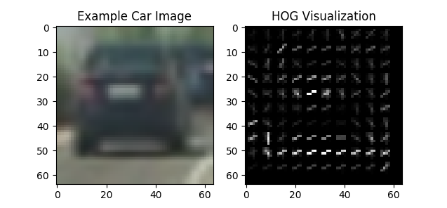

# Self-Driving Car Engineer Nanodegree Program
# *Vehicle Detection and Tracking*

## Implementation
With this implementation, vehicles will be detected in a movie and lane line detection can be integrated optionally.

**Result**:
* Vehicle detection [YouTube video] (https://www.youtube.com/watch?v=--7_5BQMqWw)
* Vehicle & lane line detection [YouTube video] (https://www.youtube.com/watch?v=c1qnClCYO-Y)

The project includes the following files:
* **vehicle_detection.rev.py**			Main functions for detecting and for tracking vehicles
* **lesson_function.rev.py**			Contains support functions

Calling python with ‘vehicle_detection.rev.py’ performs a vehicle detection on a movie by feature detection, training a classifier and using it for detection during window sliding over each image of the movie. Object smoothing and false-friend filtering is done by using a history heat-map.
Optionally, the procedures for advanced lane line finding can be included into the movie.

## Sample Feature Extraction
The code of ‘Color Classification’ enabled the study of different spatial and color histogram feature configurations and their influence on the accuracy. The program ‘HOG Classification’ supported the study of influence of different hyper-parameter on the accuracy of the ‘Histogram of Oriented Gradients’ (HOG) features.

Out of the examination, the following results for the hyper-parameter were identified as the most successful rule of thumb values for the final task.

* Color Classify (acc.: 0.9916):
  * Spatial:	16
  * Histbin:	32

* HOG Classify (acc.: 1.0):
  * Colorspace:		YCrCb
  * Orientation:		9
  * Pix_per_cell:		8
  * Cell_per_block:		2
  * Hog_channel:		“All”

For feature extraction out of samples, the routine ‘extract_features’ and its sub-routines were taken from the lecture (lesson_function.rev.py). To ensure image values of 0-255, ‘extract_features’ has been improved with regards to the imread function (lesson_function.rev.py, l.100-107):

* png-image -> cv2.imread()
* jpeg-image -> mpimg.imread()

The function supports image color conversion and extraction of spatial histogram, color histogram, and Histogram of Oriented Gradients (HOG) features on labeled car/non-car training sets. After the generation and their concatenation (vehicle_detection.rev.py, l.206-224), the features were normalized (vehicle_detection.rev.py, l.230-235).
 

HOG feature of car/non-car features were represented like:

## Classifier Training
The classifier training, together with the sample feature extraction, was implemented in the function ‘make_the_machine’ (vehicle_detection.rev.py, l.153-289).

The training sets for the classifier were based upon 64x64 images in jpeg and png format. They consisted of car (9983 images) and non-car (10.090 images) representations. These images were transformed into feature sets. The feature sets were used to train a Support Vector Machine (SVM) as classifier. After the training, the SVM was used to classify sub-windows in each image of the movie and to detect vehicles.

The datasets were read from different directories (vehicle_detection.rev.py, l.165-182). After sample feature extraction (l.206-224) and normalization (l.230-235), the normalized feature set was shuffled and split into training and test set with a ratio of 4:1 (l.251-255).
As a classifier, the Support Vector Machine (SVM) was chosen (l.258) and trained (l.261). The SVM and the normalization function were handed over to the calling procedure to use them for classification and vehicle detection (l.289).

## Vehicle Detection
The vehicle detection was performed by the function ‘detect_in_image’ (vehicle_detection.rev.py, l.291 441). For a higher degree of freedom with regards to window sliding over the image, this function was supported by the reused functions ‘slide_window’ (lesson_function.rev.py, l.141-180), ‘draw_boxes’ (lesson_function.rev.py, l.183-191), and modified function ‘search_windows_one_hog’ (vehicle_detection.rev.py, l.99-151) which was supported by ‘img_features_syntheticHOG’ (vehicle_detection.rev.py, l.72-97). The last two functions were restructured functions of the lecture’s ‘search_windows’ and ‘single_img_features’ routines to use HOG generation only once.

The procedure ‘detect_in_image’ started with the definition of the hyperparameter (l.310-333). For window sliding, the following parameter were chosen:

* Four sliding areas (l.361):
  * [0,1280],[400,720]	with window size: (128,128)
  * [0,1280],[400,640]	with window size: (96,96)
  * [0,1280],[410,602]	with window size: (64,64)
  * [160,1120],[420,580]	with window size: (32,32)
* Window dimension: 	64x64
* Overlapping: 		75%		85% (after review process)
 

With the chosen parameter, a detection looked like this:

For the first image of the movie, either the classifier could be trained by calling the function ‘make_the_machine’ (chapter 3 and 2) or by loading an already trained classifier (l.335-351). After the classifier training section, the window sliding is performed (l.356-371) followed by the heat map evaluation (l.390-424). 
The heat map is generated by overlaying all the boxes where the classifier detected cars (l.395). To suppress false friends, the history of the preceding maps is considered (l.403-414). For filtering simple outliers, a threshold is applied (l.416). The resulting heat map is labeled (l.422), and based on the labels boxes are added to the actual image (l.424) like the following window including a heat-map representation before they were integrated into the new movie:

## Discussion
The project seemed to be very challenging in finding the right hyper-parameters. Beside this, the following points were skipped due to lack of time but might be interesting for the potential future of this project:
* The linear SVM seemed to have some difficulties in classifying the white car. Maybe, it is worthwhile to use a more complex SVM.
* It would be nice to see how CNN fit in here.
* The windows for classification were sliding in a rectangular. Maybe a ‘V’-form might be more effective in avoiding false friends.
* The model might fail when the car is passed by a huge truck as it is higher than normal cars and the rectangular is adopted to a situation with cars.
